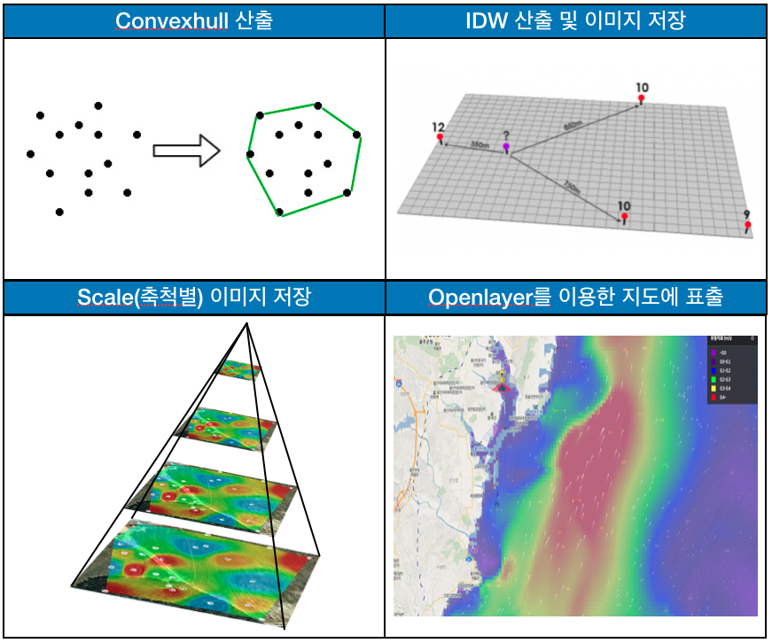

# About-me

남홍식 Hongsik Nam

 [robbins.hs@gmail.com](mailto:robbins.hs@gmail.com)

자기 소개

6년차 개발자 이며, SI 및 R&D 연구사업을 맡아서 Java Spring Framework, javascript, PostGIS등 GIS프로젝트를 진행 하였으며 항상 개발에 대해서는 장인 정신과 같은 마음으로 책임감 있게 프로젝트를 수행합니다.

\[성격의 장단점\]

전반적으로 내성적이지만 매사에 주도적 이라는 것 입니다. 주어진 일을 회피하기 보다는 적극적인 자세로 받아들일 뿐만 아니라, 프로젝트를 성공시키기 위하여 효과적으로 일할 수 있는 방법을 고민하고 실행합니다. 지금까지 이러한 장점을 바탕으로 남들보다 더 프로젝트를 장인정신이라는 생각으로 목표를 달성하고 앞으로 더 나아가기 위해 항상 노력하며 습관화 하려고 노력하고 있습니다. 하지만 의욕이 너무 앞서 종종 세부적인 사항에 대해서 챙기지 못하는 경우가 발생하기도 합니다. 이러한 노력을 극복하기 위해 Evernote를 이용하여 매일 스케줄 관리와 하루 어떤일을 했는지 작성을 합니다. 작성이후 부터 좀더 세부적인 사항도 보안 할 수 있었으며 업무에 더 집중 할 수 있었습니다.

\[프로젝트를 대하는 자세\]

항상 개발에 대해서 또는 프로젝트에 대해서 책임감과 장인정신과 같은 마음으로 임하고자 노력합니다. 장인정신과 같은 생각으로 항상 어떻게 하면 효율적으로 코드를 작성 할 수 있는지, 어떻게 하면 좀더 프로페셔널 하게 개발을 할 수 있는지 고민합니다. 프로젝트를 하면서 조금씩 새로운 것을 도입하여 조금이라도 더 나은 프로젝트를 만들고자 노력하고 실행 합니다.

이러한 노력을 하기 위해서는 항상 새로운 것에 대해서 학습하고 기술을 익혀 발전 시키고자 노력합니다. 소소한 도전 정신과 열정으로 퇴근 후 집에서는 새로운 것에 대해 학습하고 필요한 서적도 잠들기전 조금이라도 읽으려고 하는 습관을 유지 하려고 합니다.

\[무한한 잠재력과 가능성의 시너지\]

항상 인정받기 위해 끊임없이 노력하고 개발에 대해서 자부심을 느끼고 있습니다. 제 자신의 능력을 인정받아 새로운 기회를 만들고 다양한 경험을 하는 것을 갈망 하고 있습니다. 또한 리더와 함께 팀과 함께 소통하며 생각의 폭을 넓혀가며 제 자신의 능력을 더 발산 시키고 싶습니다.

학력

2009.03 ~ 2015.02 남서울대학교 GIS 공학과

자격증

2013.06 OCJP 취득\(Oracle\)

2018.08 정보처리기사\(한국산업인력공단\)

교육

2013.08 SkylineGlobe Education Program 과정 - 한국IMU

 -3D GIS개발 교육\(TerraExplorer\)

2018.08 오픈소스 GIS 서비스 개발자 교육 입문 - 공간정보아카데미

 - PostGIS, Geoserver, Openlayers 교육

Dev Flow

\(주\)에스지원정보기술\(2014.08 ~ 2018.12\) - 담당업무 추가할것.

이력사항

* 경남 고성군 공간정보 시스템 개발
* 송도국제도시 U-City 1단계\(U-시설관리\) 개발
* 인천 상수도 관리시스템 유지보수\(GIS\) 유지보수
* 항계안전 해양정보 확대를 위한 시스템 개발
* 항행통보 경보 서비스 체계 시스템 개발
* 한국형 e-Navigation 서비스 개발
  * 해사안전정보 서비스 개발

\(주\)유에스티21\(2019.02 ~ 2020.02\) - 담당업무 추가할것.

* 차세대 수로제품\(S-100\) 관리체계 시스템 개발\(SI\)
* 한국형 e-Navigation 서비스 개발\(R&D\)
  * 항해간행물 및 수로정보 서비스 개발
* 항로표지 정보의 스마트화 전략 연구 용역\(R&D\)

항로표지 정보의 스마트화 전략 연구용역\(2019.12\)

* Docker기반 Remote RESTful API 개발
  * Docker Image 관리\(Docker file build 및 repository push\)
  * Docker Container 관리\(생성, 삭제, 시작, 종료\)
  * Elasticsearch와 Logstash를 이용한 Container에 포함된 Spring boot Application 로그 기록
  * 사용기술
    * OS : RedHat 7.6
    * Open JDK 1.8, Spring Boot2, Swagger UI
    * Docker Remote API
    * Elasticsearch, Logstash, Kibana
    * Etc : Jenkins, Nexus\(Docker 저장소\)

차세대 수로제품\(S-100\) 관리 체계 구축\(2019.03 ~ 2019.11\)

* 공급관리를 위한 RESTful API 개발
* 국제 표준 IHO S-100 의 Metadata 표준 분석
* ExchangeSet Metadata 생성 및 패키징 개발
* 생성된 ExchangeSet Metadata을 배포 기능 개발
* C\#을 이용한 공급체계 관리 시스템 UI 개발\(공급승인, 교환셋생성룰, 배포처관리\)
* 사용기술
  * OS : Windows Server 2016
  * DBMS : Postgresql 9.6, PostGIS 2.5

프로젝트

* * Backend : OpenJDK1.8, eGovFrame3.8
  * Frontend : C\# 4.5, Infragistics\(UI\)

한국형 e-Navigation 서비스를 위한 핵심 기술연구 개발

* 해사 안전 정보 서비스 개발 \(2018.01 ~ 2018.12\)
  * 국제 표준 IHO S-124\(Navigation Warming\) 표준 분석
  * S-124\(Navigation Warming\) 생성 모듈 개발
  * S-124\(Navigation Warming\) 제공을 위한 RESTful API 개발, SwaggerUI 연동
  * ExchangeSet Metadata 서비스를 위한 DB 설계
  * S-124\(Navigation Warming\) 긴급 제공을 하기 위한 DDS Push 서비스 개발
  * 사용기술
    * OS : RedHat 7.5
    * DBMS : Postgresql 9.6, PostGIS 2.5
    * Backend : Spring framework 4
    * Frontend : SwaggerUI
    * Etc : Jenkins, Sparrow\(정적분석도구\)
* 항해간행물 및 수로정보 서비스 개발\(2019.02 ~ 2019.12\)
  * 국제 표준 IHO S-100 의 Metadata 표준 분석
  * 국제 표준 IHO S-102\(해저지형\) S-104\(조석정보\), S-111\(해수유동\) 표준 분석
  * 선박과 통신 하기 위한 DDS Interface 서비스 개발\(Topic Validation\)
  * S-102\(해저지형\), S-104\(조석정보\), S-111\(해수유동\) 서비스 제공을 위한 RESTful Service API 개발
  * 성과지표에 따른 품질검증 개선
  * 실선테스트 진행
  * 사용기술
    * OS : RedHat 7.5
    * DBMS : Postgresql 9.6, PostGIS 2.5
    * Backend : Spring framework 3
    * Etc: Jenkins, Sparrow\(정적분석\)

 항행통보 경보 서비스 체계 확대 개발\(2017.06 ~ 2017.11\)

* * 국제 표준 IHO S-124\(Navigation Warming\) 표준 분석
  * 국립해양 조사원 항행경보 발행시 자동으로 S-124\(Navigtion Warming\) 생성 기능 개발
  * 온바다 서비스를 위한 항행경보 이미지 생성 기능 개발
  * 사용기술
    * OS : Window Server 2016
    * DBMS : Oracle 11g
    * Backend : eGovFrame3.5, Oracle JDK 1.8
    * Frontend : JSP, Ajax, Openlayers2
    * Etc : O2Server\(WMS\) 연계

 항계안전 해양정보 확대를 위한 시스템 구축 및 개선\(2017.05 ~ 2017.11\)

* * 항구별 해양기상자료데이터를 가시화 기능 구현\(HeatMap\)
  * 항구별 항행경보\(S-124\) 데이터 표출 기능 구현
  * 해양 기상자료별 가시화 비교
  * 사용기술
    * OS : Window Server 2016
    * DBMS : Oracle 10g, Postgresql 9.6, PostGIS 2.4
    * Backend : eGovFrame3.5, Oracle JDK 1.8
    * Frontend : SPA\(HTML, Ajax\), Openlayers3
    * Etc : GeoServer

 인천시 상수도관리시스템\(GIS\) 유지보수 \(2016.03 ~ 2017.02\)

* * 상수도 관리시스템 기능 개선 및 장애처리
  * 공간정보 갱신\(연속 지적도 및 행정구역 및 새주소 공간데이터\)
  * 상수도 데이터 통계 정보 산출
  * 사용기술
    * Software : ArcMap 9.3, ArcServer ArcSDE 9.3
    * DBMS : Oracle 10g
    * Backend : Spring, Java JDK
    * Frontend : Adobe Flex, C\#

 인천광역시 송도국제도시 U-City 1단계 구축 사업\(2015.01 ~ 2016.03\)

* * U-시설물 관리 서비스
  * 시설물 상태 관리, 시설물 점검 관리, 시설물 정보 관리
  * 시설물 통계 관리 기능 구현
  * 사용기술
    * DBMS : Tibero
    * Backend : eGovFrame3.1 Java JDK 1.7
    * Frontend : ExtJS

 경남 고성군 공간정보 시스템 고도화 유지보수\(2015.01 ~ 2018.12\)

* * 시설물 관리시스템 점검, 장애 처리, 기능 수정
  * 공간데이터 갱신\(새주소, 용도지역지구, 상하수도로\) 갱신
  * 연속지적도 편집
  * 사용기술
    * Software : ArcMap 10.1
    * DBMS : Altibase
    * Backend : Java JDK 1.6, eGovFrame2.5
    * Frontend : JSP, Ajax, Openlayers2
    * Etc : O2Server 사용

 경남 고성군 공간정보 시스템 고도화 \(2014.08 ~ 2015.01\)

* 상수, 하수, 도로, 기타시설물 관리 대장 기능 구현
* 상수, 하수, 도로, 기타시설물을 O2Server를 이용한 레이어 표출 기능 구현
* 항공사진 타일링 구축 및 TMS 기능 구현
* 부동산종합공부 시스템 연계
* 사용기술
  * * Software : ArcMap 10.1
    * DBMS : Altibase
    * Backend : Java JDK 1.6, eGovFrame2.5
    * Frontend : JSP, Ajax, Openlayers2
    * Etc : O2Server 사용

항계안전 해양정보 확대를 위한 시스템 구축 및 개선

* HeatMap 랜더링 개선

문제점:

 예측모델에 따른 생성데이터에 대해서 항구별로 지도에 Openlayers를 이용하여 HeatMap을 가시화를 구현하였습니다. 하지만 항구에 표출되는 해양데이터가 항구별로 적게는 2,000개에서 80,000개까지 항구별로 다양 하였으며 해양데이터를 기준으로 웹브라우저에서 랜더링할때 몇초에서 2분까지 브라우저에서 랜더링 하는 퍼포먼스가 차이가 상이하였고 다소 시간이 많이 걸리는 문제가 발생 하였습니다.

프로젝트별

개선**/**문제점 해결

해결방안: 웹브라우저에서 HeatMap을 랜더링하는 방법에서 백엔드에서 랜더링 하는 방법으로 변경

1. 해양예측모델에서 항구별 Geometry를 조회하여 Geometry에서 Convexhull 산출한다.
2. 역거리가중법\(Inverse Distance Weighted\)산출 및 이미지 저장
3. Scale\(축척별\) 이미지 저장
4. Openlayers를 이용한 랜더링한 이미지 지도에 표출

결과 :

브라우저 마다 랜더링 하지 않고 랜더링된 이미지를 가시화 하기때문에 속도가 크게 개선.

스마트 항로표지 연구 개발 구성도

차세대 수로제품\(S-100\) 관리 체계 구성도

프로젝트별

시스템 구성도

한국형 e-Navigation 서비스를 위한 핵심 기술연구 개발 구성도

