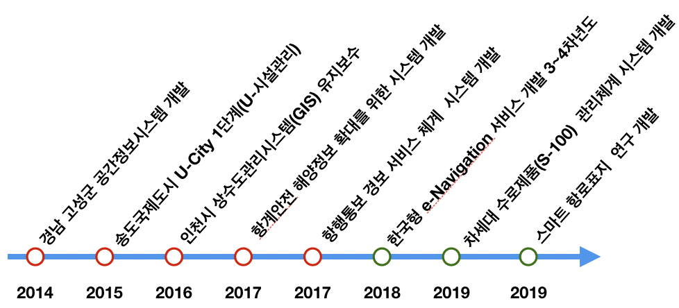
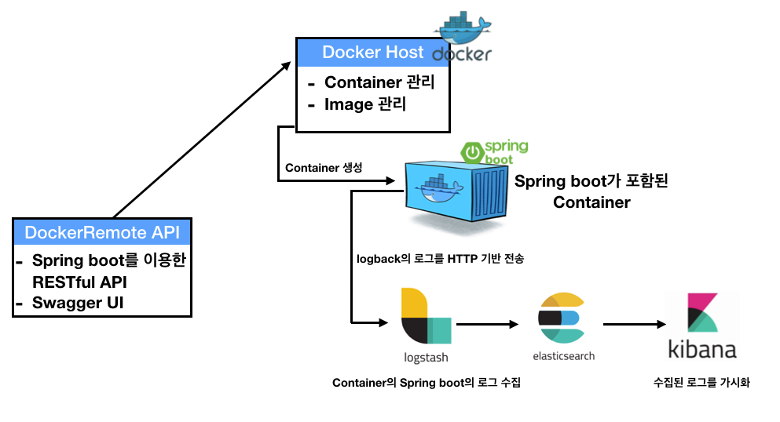
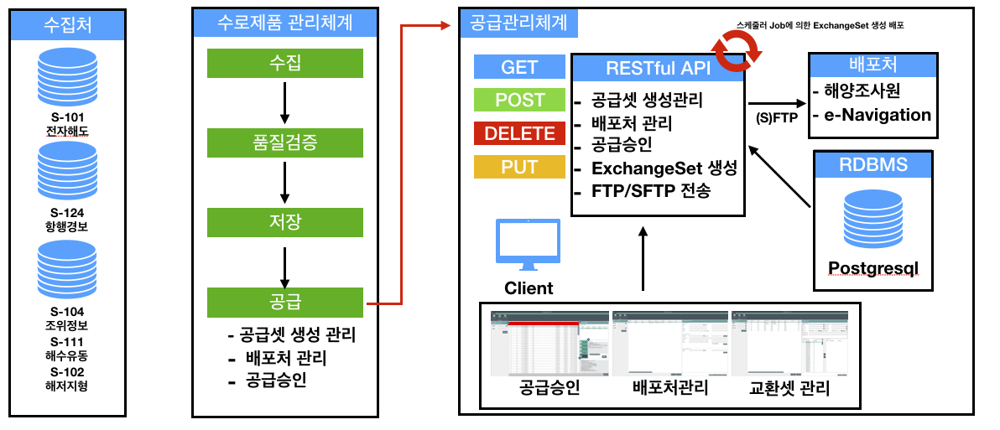
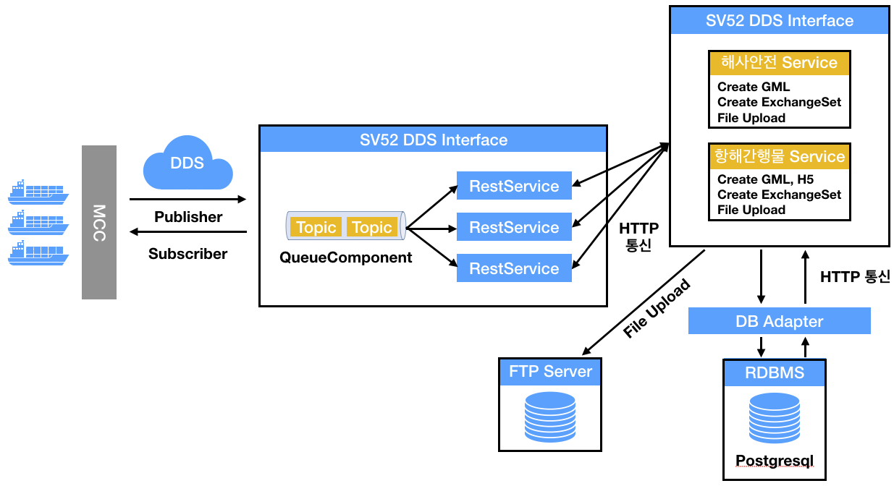

# About-me

## 자기 소개 😀

SI 및 R&D 연구사업을 맡아서 Java Spring Framework, javascript, PostGIS등 GIS프로젝트를 진행 하였으며 항상 개발에 대해서는 장인 정신과 같은 마음으로 책임감 있게 프로젝트를 수행합니다. 

### \[프로젝트를 대하는 자세\]

항상 개발에 대해서 또는 프로젝트에 대해서 책임감과 장인정신과 같은 마음으로 임하고자 노력합니다. 장인정신과 같은 생각으로 항상 어떻게 하면 효율적으로 코드를 작성 할 수 있는지, 어떻게 하면 좀더 프로페셔널 하게 개발을 할 수 있는지 고민합니다. 프로젝트를 하면서 조금씩 새로운 것을 도입하여 조금이라도 더 나은 프로젝트를 만들고자 노력하고 실행 합니다.

이러한 노력을 하기 위해서는 항상 새로운 것에 대해서 학습하고 기술을 익혀 발전 시키고자 노력합니다. 소소한 도전 정신과 열정으로 퇴근 후 집에서는 새로운 것에 대해 학습하고 필요한 서적도 잠들기전 조금이라도 읽으려고 하는 습관을 유지 하려고 합니다.

### \[무한한 잠재력과 가능성의 시너지\]

항상 인정받기 위해 끊임없이 노력하고 개발에 대해서 자부심을 느끼고 있습니다. 제 자신의 능력을 인정받아 새로운 기회를 만들고 다양한 경험을 하는 것을 갈망 하고 있습니다. 또한 리더와 함께 팀과 함께 소통하며 생각의 폭을 넓혀가며 제 자신의 능력을 더 발산 시키고 싶습니다.

### \[Dev Flow\]

~~~~🐶 ~~\(주\)XXXX정보기술~~\(2014.08 ~ 2018.12\)

* 경남 고성군 공간정보 시스템 개발\(SI, SM\)
* 송도국제도시 U-City 1단계\(U-시설관리\) 개발\(SI\)
* 인천 상수도 관리시스템 유지보수\(GIS\) 유지보수\(SM\)
* 항계안전 해양정보 확대를 위한 시스템 개발\(SI\)
* 항행통보 경보 서비스 체계 시스템 개발\(SI\)
* 한국형 e-Navigation 서비스 개발\(R&D\)
  * 해사안전정보 서비스 개발

🐶🐱 ~~\(주\)XXXX21~~\(2019.02 ~ 2020.02\)

* 차세대 수로제품\(S-100\) 관리체계 시스템 개발\(SI\)
* 한국형 e-Navigation 서비스 개발\(R&D\)
  * 항해간행물 및 수로정보 서비스 개발
* 항로표지 정보의 스마트화 전략 연구 용역\(R&D\)

😍 \(주\)XXXXX\(2020.03 ~ 현재\)

* GIS 관련 프로젝트 진행

### **Project List**

* **항로표지 정보의 스마트화 전략 연구용역\(2019.12\)**
  * IALA\(국제항로표지 협회\)에서 제안하는 MRN 지침에 따라 해상자원을 관리 할 수 있는 해상자원명\(MRN\) 발급하는 관리 체계 구축하고 MRN 발급 Open API Service를 Docker로 관리
  * Docker기반 Remote RESTful API 개발
    * Docker Image 관리\(Docker file build 및 repository push\)
    * Docker Container 관리\(생성, 삭제, 시작, 종료\)
    * Elasticsearch와 Logstash를 이용한 Container에 포함된 Spring boot Application 로그 기록
    * 사용기술
      * OS : RedHat 7.6
      * Open JDK 1.8, Spring Boot2, Swagger UI
      * Docker Remote API
      * Elasticsearch, Logstash, Kibana
      * Etc : Jenkins, Nexus\(Docker 저장소\)

* **차세대 수로제품\(S-100\)관리 체계 구축\(2019.03 ~ 2019.11\)**
  * 한국형 e-Navigation 운영에 필요한 해양 수로데이터\(S-100 표준 데이터\) 수집 및 공급을 위한 공급체계 구축 
    * 공급관리를 위한 RESTful API 개발
    * 국제 표준 IHO S-100 의 Metadata 표준 분석
    * ExchangeSet Metadata 생성 및 패키징 개발
    * 생성된 ExchangeSet Metadata을 배포 기능 개발
    * C\#을 이용한 공급체계 관리 시스템 UI 개발\(공급승인, 교환셋생성룰, 배포처관리\)
    * 사용기술
      * OS : Windows Server 2016
      * DBMS : Postgresql 9.6, PostGIS 2.5
      * Backend : OpenJDK1.8, eGovFrame3.8Frontend : C\# 4.5, Infragistics\(UI\)

* **한국형 e-Navigation 서비스를 위한 핵심 기술연구 개발**

  * 차세대 선박운항체계로써 기존의 선박운항, 조선기술에 정보 통신기술\(ICT\)을 접목하여 각종 해양 정보를 국제 표준화, 디지털화 하여 선박 또는 육상간 실시간 상호 공유토록 함으로써 안전과 효율을 동시에 추구 할 수 있는 시스템을 구축한다. 그 중 해사 서비스 목록 중 항행 간행물 서비스, 실시간 수로 정보 서비스를 구현하기 위해 관계기관\(국립해양조사원\)으로 부터 서비스 데이터를 제공 받아 Smart Navigation 단말기\(선박 사용자\)에게 요구사항\(서비스 종류 , 위치, 시간, 항로\)에 맞춤형 해양 안전 정보를 제공하는 서비스를 개발

  * **해사 안전 정보 서비스 개발 \(2018.01 ~ 2018.12\)**
    * 국제 표준 IHO S-124\(Navigation Warming\) 표준 분석
    * S-124\(Navigation Warming\) 생성 모듈 개발
    * S-124\(Navigation Warming\) 제공을 위한 RESTful API 개발, SwaggerUI 연동
    * ExchangeSet Metadata 서비스를 위한 DB 설계
    * S-124\(Navigation Warming\) 긴급 제공을 하기 위한 DDS Push 서비스 개발
    * 사용기술
      * OS : RedHat 7.5
      * DBMS : Postgresql 9.6, PostGIS 2.5
      * Backend : Spring framework 4
      * Frontend : SwaggerUI
      * Etc : Jenkins, Sparrow\(정적분석도구\)
  * **항해간행물 및 수로정보 서비스 개발\(2019.02 ~ 2019.12\)**
    * 국제 표준 IHO S-100 의 Metadata 표준 분석
    * 국제 표준 IHO S-102\(해저지형\) S-104\(조석정보\), S-111\(해수유동\) 표준 분석
    * 선박과 통신 하기 위한 DDS Interface 서비스 개발\(Topic Validation\)
    * S-102\(해저지형\), S-104\(조석정보\), S-111\(해수유동\) 서비스 제공을 위한 RESTful Service API 개발
    * 성과지표에 따른 품질검증 개선
    * 실선테스트 진행
    * 사용기술
      * OS : RedHat 7.5
      * DBMS : Postgresql 9.6, PostGIS 2.5
      * Backend : Spring framework 3
      * Etc: Jenkins, Sparrow\(정적분석\)

*  **항행통보 경보 서비스 체계 확대 개발\(2017.06 ~ 2017.11\)**
  * 선박의 안전운항을 위한 긴급사항과 항행안전을 위한 다양한 정보를 정확하게 전달 할 수 있도록 시스템을 개발
    * 국제 표준 IHO S-124\(Navigation Warming\) 표준 분석
    * 국립해양 조사원 항행경보 발행시 자동으로 S-124\(Navigtion Warming\) 생성 기능 개발
    * 온바다 서비스를 위한 항행경보 이미지 생성 기능 개발
    * 사용기술
      * OS : Window Server 2016
      * DBMS : Oracle 11g
      * Backend : eGovFrame3.5, Oracle JDK 1.8
      * Frontend : JSP, Ajax, Openlayers2
      * Etc : O2Server\(WMS\) 연계
*  **항계안전 해양정보 확대를 위한 시스템 구축 및 개선\(2017.05 ~ 2017.11\)**
  * 국립해양조사원에서 수집되는 해수 유동, 실시간 해양관측, 수온, 염분 등 수많은 실측 및 예측 데이터를 분석하여 해난 사고 예방을 위한 해양 정보를 시각화하는 시스템 개발
    * 항구별 해양기상자료데이터를 가시화 기능 구현\(HeatMap\)
    * 항구별 항행경보\(S-124\) 데이터 표출 기능 구현
    * 해양 기상자료별 가시화 비교
    * 사용기술

      * OS : Window Server 2016
      * DBMS : Oracle 10g, Postgresql 9.6, PostGIS 2.4
      * Backend : eGovFrame3.5, Oracle JDK 1.8
      * Frontend : SPA\(HTML, Ajax\), Openlayers3
      * Etc : GeoServer
*  인천시 상수도관리시스템\(GIS\) 유지보수 \(2016.03 ~ 2017.02\)
  * 인천시 상수도 GIS관리 시스템 안정적인 운영 도모, 상수도 관리시스템 기능 개선 및 기능 추가,  타 시스템과의 기능 연동 이용 및 기술지원
    * 상수도 관리시스템 기능 개선 및 장애처리
    * 공간정보 갱신\(연속 지적도 및 행정구역 및 새주소 공간데이터\)
    * 상수도 데이터 통계 정보 산출
    * 사용기술

      * Software : ArcMap 9.3, ArcServer ArcSDE 9.3
      * DBMS : Oracle 10g
      * Backend : Spring, Java JDK
      * Frontend : Adobe Flex, C\#
*  **인천광역시 송도국제도시 U-City 1단계 구축 사업\(2015.01 ~ 2016.03\)**
  * 도시 전체를 하나의 통신망으로 연결하고 개별서비스\(행정, 교통, 방법, 방재,  시설물관리 등\)를 상호연계 구축하여 첨단 서비스 제공 및 관제기능을 통합적으로 수행함으로써 통합운영 플랫폼 및 U-City 서비스를 구
    * U-시설물 관리 서비스
    * 시설물 상태 관리, 시설물 점검 관리, 시설물 정보 관리
    * 시설물 통계 관리 기능 구현
      * 사용기술
        * DBMS : Tibero
        * Backend : eGovFrame3.1 Java JDK 1.7
        * Frontend : ExtJS
*  **경남 고성군 공간정보 시스템 고도화 유지보수\(2015.01 ~ 2018.12\)**
  * 경남 고성군의 상수, 하수, 도로 시설물의 효율적인 관리를 위한 웹 시설물 관리 시스템 유지보
    * 시설물 관리시스템 점검, 장애 처리, 기능 수정
    * 공간데이터 갱신\(새주소, 용도지역지구, 상하수도로\) 갱신
    * 연속지적도 편집
    * 사용기술

      * Software : ArcMap 10.1
      * DBMS : Altibase
      * Backend : Java JDK 1.6, eGovFrame2.5
      * Frontend : JSP, Ajax, Openlayers2
      * Etc : O2Server 사용
*  **경남 고성군 공간정보 시스템 고도화 \(2014.08 ~ 2015.01\)**
  * 경남 고성군의 상수, 하수, 도로 시설물의 효율적인 관리를 위한 웹 시설물 관리 시스템 구축
    * 상수, 하수, 도로, 기타시설물 관리 대장 기능 구현
    * 상수, 하수, 도로, 기타시설물을 O2Server를 이용한 레이어 표출 기능 구현
    * 항공사진 타일링 구축 및 TMS 기능 구현
    * 부동산종합공부 시스템 연계
    * 사용기술
      * Software : ArcMap 10.1
      * DBMS : Altibase
      * Backend : Java JDK 1.6, eGovFrame2.5
      * Frontend : JSP, Ajax, Openlayers2
      * Etc : O2Server 사용

