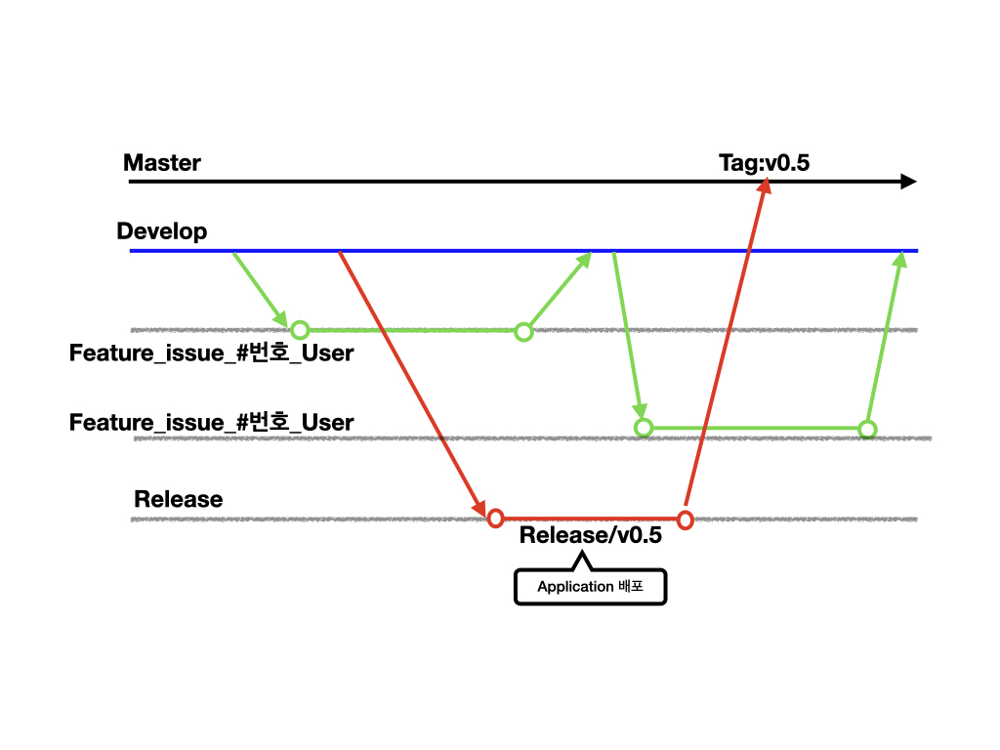

# GIT Strategy

## Git Flow

* Master Branch = 제품이 출시 되는 메인 브랜치
* Develop Branch = 개발이 진행되는 메인 브랜치
* Feature Branch = 기능을 개발하는 브랜치 이며 각각의 개발자들이 Develop에서 브랜치를 만들어서 기능을 개발한다. 기능 개발완료후 Develop 브랜치에 병합한다. Feature 브랜치명은 **feature/issue\_\#번호\_개발자명** 으로 정한다. feature는  feature라는걸 구분하기 위한 이름이고 issue\_\#번호\_개발자명은 모든 개발회사들이 GitLab, Github를 사용하고 있기 때문에 해당 issue를 생성하여 issue번호를 붙여 이슈관리가 되도록 진행한다.
* Release = 이번 출시 버전을 준비하는 브랜치
* hotfix = 출시 버전에 발생한 버그를 수정 하는 브랜치

## 이슈 관리 방

