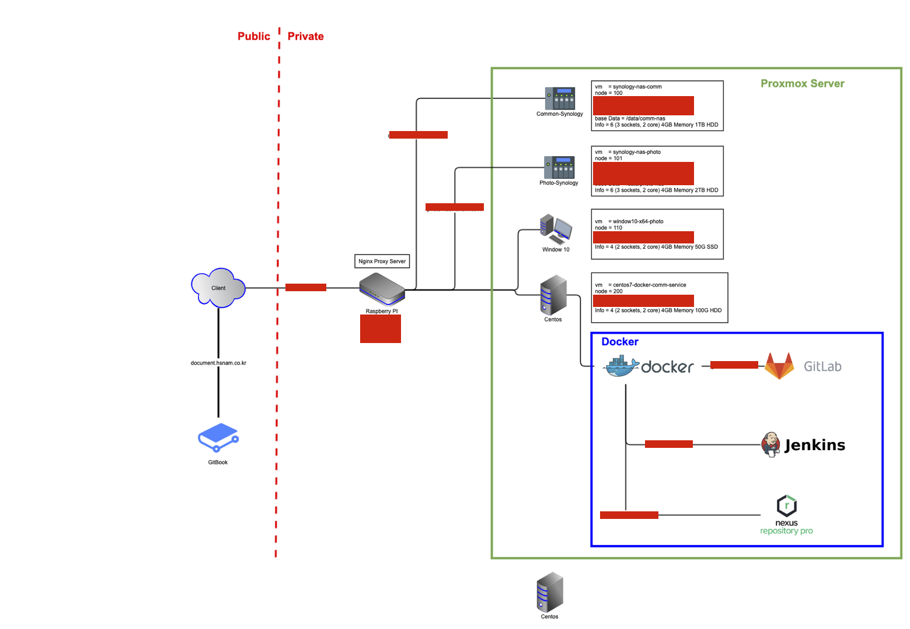

# 02. Proxmox를 이용한 홈네트워크 구성

## Home Network 구성도

지금현재 집에서 사용하고 있는 Home Network 구성도이다. 지금 사용하고 있는 Gitbook도 도메인에 연결하여 서브도메인으로 사용하고 있다.

대략적으로 설명하면 물리적 서버는 총 2대이다. TS-140에 올라가고 있는 Proxmox 서버 그리고 24시간 켜져 있는 Raspberry2 이렇게 2대가 운영되고 있고 라즈베리를 통하여 TS-140 서버를 키고 끄고 할 수 있다.

라즈베리파이에 운영되고 있는 Nginx Proxy Server를 통하여 Proxmox에 운영되고 있는 서비스를 연결해주고 있으며 대표 도메인을 통하여 각각의 서비스들이 서브도메인을 통하여 접속 할 수있다.

각각의 Synology 서버들은 사진 관리 및 프로젝트 파일 관리로 운영하고 있으며 Window10 서비스는\(?\)는 그냥 집에 윈도우제품이 없어서 ActiveX 대응으로 만들어 놓은 컨테이너이다 그리고 대망의 Centos 서버 내가 제일 좋아하는 Docker 가 운영되고 있으며 그안에 GitLab, Jenkins, nexus가 운영되고 있다. 

여기까지 Proxmox를 통한 홈네트워크 구성 설명이였으며 다음페이지 부터는 환경을 구성하면서 설정하는 방법에 대해서 디테일하게 설명하겠다. 👍 

