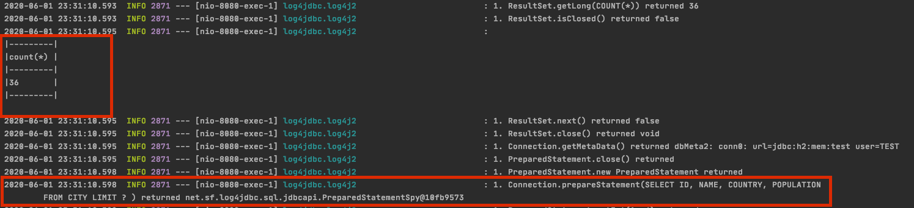
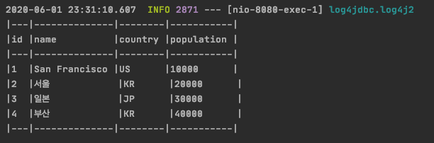

# Mybatis-PagingHelper

 ~~Paging과 관련 없는 개발~~을 많이 해왔다. ㅠ 개발 짬밥을 거꾸로 먹은 느낌이랄까? 😰 간만에 페이징 로직을 다시 확인해봤는데 휴 너무나도 귀찮고 힘겨운 일이다. 그래서 이미 누군가 구현해 만들어 놓았다. 별로 어렵지 않아 따라하면 순삭일듯. 써보니 나름 괜찮다. 다른 프로젝트에서도 도입 할 수 있으면 도입 할 의향이 있다. 하지만 단점이 있다. 단점은 일단 사용법을 보고 판단! 😍 

### Add Dependency

사용버전은 1.2.12 상위버전을 추천한다.

For Maven : 

```markup
 <dependency>
  <groupId>com.github.pagehelper</groupId>
  <artifactId>pagehelper-spring-boot-starter</artifactId>
  <version>1.2.12</version>
</dependency>
```

For Gradle : 

```groovy
'com.github.pagehelper:pagehelper-spring-boot-starter:jar:1.2.12'
```

### Configuration PageHelper

```yaml
pagehelper.helper-dialect=sqlite # 데이터 타입
pagehelper.reasonable=true
pagehelper.support-methods-arguments=true #true이면 mapper에서 page parameter 사용가능
```

**Controller**

-Rest Controller에서 페이지 번호, 한페이지 보여줄 게시글을 RequestParam으로 받아 Service 로 전달한다. PageInfo클래스에는 페이징에 필요한 시작페이지, 끝페이지, 총카운트, 이전, 이후 페이지 여부, 등등 필요한 항목을 계산하여 전달하게 된다.

```java

    @Autowired
    private CityService cityService;
    
    /**
     * 페이지 조회
     * @param pageNum 페이지 번호
     * @param pageSize 한페이지에 보여줄 게시글 수
     * @return
     */
    @RequestMapping(value = "/city", method = RequestMethod.GET)
    public ResponseEntity<PageInfo> selectCityList(@RequestParam(defaultValue = "1") Integer pageNum,
                                                    @RequestParam(defaultValue = "3") Integer pageSize){
        try{

            log.info("pageNum = {}, pageSize={}", pageNum, pageSize);
            PageInfo<CityModel> list =cityService.selectCityList(pageNum, pageSize);
            log.info("City List size = {}", list);
            return ResponseEntity.ok(list);
        }catch (Exception e){
            log.info(e.getMessage());
            return ResponseEntity.status(HttpStatus.INTERNAL_SERVER_ERROR).build();
        }
    }
```

**Service**

서비스목록이며 리턴값 PageInfo&lt;CityModel&gt; 으로 전달한다.

```java
    @Autowired
    private CityDao cityDao;

    /**
     * 페이지 조회
     * @param pageNo 페이지 번호
     * @param pageSize 한페이지에 보여줄 크기
     * @return
     */
    public PageInfo<CityModel> selectCityList(int pageNo, int pageSize){
        return cityDao.selectCityList(pageNo, pageSize);
    }
```

**Dao**

Repository부분이며 가장 **핵심포인트 부분이다.** PageHelper 클래스에 startPage를 설정해준다\(내부적으로 계산식을 넣기 위한 부분으로 추측..\) 그리고 다음으로 PageInfo 클래스에 select한 목록을 담아서 전달한다.

이렇게만 보면 full 쿼리를 하여 PageInfo에 담는거처럼 보이지만 실제로는 아니다. 맨처음 해당 SELECT 하는 테이블에 총합계를 조회 하고 다음으로 SELECT 쿼리문에 LIMIT  OFFSET 자동으로 붙여 완성된 페이징 쿼리를 조회한다.

```java
    private String namespace="com.hsnam.spring.paging";

    @Autowired
    private SqlSession sqlSession;

    /**
     * 페이지 조회
     * @param pageNo 페이지 번호
     * @param pageSize 화면에 보여줄 게시글 갯수
     * @return
     */
    public PageInfo<CityModel> selectCityList(int pageNo, int pageSize){
        PageHelper.startPage(pageNo, pageSize);
        return PageInfo.of(sqlSession.selectList(namespace+".selectCityList"));
    }
```

**SQL**

```markup
<mapper namespace="com.hsnam.spring.paging">
    <select id="selectCityList" resultType="CityModel">
        SELECT ID, NAME, COUNTRY, POPULATION
        FROM CITY
    </select>
</mapper>
```

### 조회하는과정 확인

사실 위 사용법대로 실제로 사용하면 이 플러그인이 어떻게 작동하는지 대체 알 수가 없다 직접 로그백에 쿼리를 찍어 결과를 확인해보자.!

먼저 로그를 찍을수 있게 라이브러리 추가.

**POM.XML**

```markup
<dependency> 
    <groupId>org.bgee.log4jdbc-log4j2</groupId> 
    <artifactId>log4jdbc-log4j2-jdbc4.1</artifactId> 
    <version>1.16</version> 
</dependency>
```

spring datasource에 log4jdbc를 추가 한다.  driver-class-name은 아래 항목과 같이 그대로 써주고 jdbc-url 부분에 log4jdbc 항목을 추가해준다.

**application.yml**

```markup
spring.datasource.hikari.driver-class-name=net.sf.log4jdbc.sql.jdbcapi.DriverSpy
spring.datasource.hikari.jdbc-url=jdbc:log4jdbc:h2:mem:test
spring.datasource.hikari.username=test
spring.datasource.hikari.password=test
```

마지막으로 logback.xml을 아래와 같이 추가하여 SQL 항목을 Debug로 변경해준다.

**logback.xml**

```markup
<?xml version="1.0" encoding="UTF-8"?>
<!DOCTYPE configuration>
<configuration>
    <include resource="org/springframework/boot/logging/logback/base.xml" />
    <logger name="jdbc.splonly" level="DEBUG" />
    <logger name="jdbc.sqltiming" level="INFO" />
    <logger name="jdbc.audit" level="WARN" />
    <logger name="jdbc.resultset" level="ERROR" />
    <logger name="jdbc.resultsettable" level="ERROR" />
    <logger name="jdbc.connection" level="INFO" />
</configuration>
```

### 확인!

아래 로그를 확인해보면 첫번째로 총카운트를 구한다. 난대체 총카운트 쿼리를 작성한적이 없는데 어디서 튀어 나왔을까? 해당 라이브러리에서 자동으로 테이블에 대한 총 카운트 쿼리를 조회 한다.

다음은 Select 쿼리문이다 뒤에 where조건을 보면 LIMIT 부분이 붙는다 이 역시도 자동으로 조회 해서 가져오는 부분이다.



결과는 풀쿼리를 조회 하지 않고 페이징 되어 조회한다. 





HTTP Test



mybatis Paging-Helper Test






4



1










```
{
  "pageNum": 1,
  "pageSize": 4,
  "size": 4,
  "startRow": 1,
  "endRow": 4,
  "total": 15,
  "pages": 4,
  "list": [
    {
      "id": 1,
      "name": "San Francisco",
      "country": "US",
      "population": 10000
    },
    {
      "id": 2,
      "name": "서울",
      "country": "KR",
      "population": 20000
    },
    {
      "id": 3,
      "name": "일본",
      "country": "JP",
      "population": 30000
    },
    {
      "id": 4,
      "name": "부산",
      "country": "KR",
      "population": 40000
    }
  ],
  "prePage": 0,
  "nextPage": 2,
  "isFirstPage": true,
  "isLastPage": false,
  "hasPreviousPage": false,
  "hasNextPage": true,
  "navigatePages": 8,
  "navigatepageNums": [
    1,
    2,
    3,
    4
  ],
  "navigateFirstPage": 1,
  "navigateLastPage": 4,
  "firstPage": 1,
  "lastPage": 4
}
```






Mybatis Paging Helper 사용하다 보면 참 편한 라이브러리 같다.  하지만 의문점이 든다. 항상 페이징 쿼리를 할때마다 총합계 쿼리를 해야 할까? 이 총합계 부분을 알고 있으면 쿼리 수행하기 전에 넣어주고 하면 실질적으로 쿼리는 단한번만 수행되는데 이부분 참으로 아쉽다. 그리고 다음 성능문제. 일반 게시판 용도로 사용해도 무방 할꺼 같은다 만건 넘어가는 게시판에서는 과연 제대로 성능이 나와줄지. 이또한 확인해봐야 할거 같다.. 이상끝. ☺ 


\[[Mabatis-PagineHelper\] :](https://github.com/hong-brother/mybatis-paging-helper) Github

