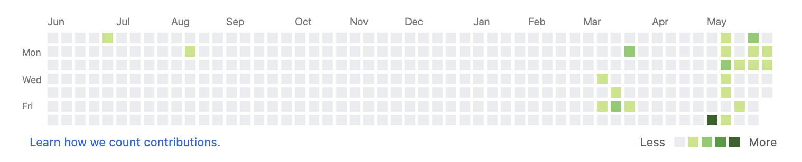

# 활동 로그

## 2020-06월 

### 06월 04일 활

* TIL\(Today I Learned\) 실천 하기로 했지만 야근과 음주로 내 잔디는 텅텅 비어 있다...

* 회사를 이직한지 얼마 되지는 않았지만 적응하기 어렵다. 사람들을 관계 및 그 관계속에서 업무의 성과..
* 이직하기 전에는 항상 나는 열심히 하고 노력하고 성과도 좋았고 항상 인정 받았다. 하지만 새로 이직한 그곳은 다 좋았지만 우울안에 개구리 인거 처럼 더 넓은 세상에 나와보니 그동안에 했던 것들이 아무것도 아니였다 라는 생각이 들어 번아웃이 오는거 같다 뭐 번아웃이 오는게 나쁘지는 않다. 번아웃으로 인해 항상 성장하고 올라갈 수 있는 발판을 만들기 때문에 좋다 생각한다.
* 앞에 게소리들을 많이 짖어 버렸고 ㅋ 앞으로 내 자신을 위해서 열심히 할 거고 노력할거 인데 항상 누군가에게 회사한테 인정 받기 위해 노력할 것이다. 
* 그 노력하는 발판중에 하나가 TIL이다 하지만 지금 TLI 하기로한지 한달이 지났지만 내 잔디는 텅텅 비어 있다... 노력하자
* 앞으로는 매일 작성하는것도 좋치만 주말에 성래와 커피숍에서 공부를 하니 거기서 1주일치를 다 작성해서 매일 출근해서 아침에 올려야 겠다. 그게 더 보기 좋을거 같디.

